# Comparison of Physics-Based and Statistical Approaches for Dynamic Breast Thermography Analysis

This repository contains a reproducible analysis pipeline for dynamic infrared breast thermography data from the DMR-IR database. The project compares statistical surface-temperature descriptors, physics-informed recovery descriptors, and an extension of the project provides temporal neural-network models for binary classification of healthy and sick cases.

This work was developed for the major research project by 
Surayia Rahman @ Toronto Metropolitan University (501145340)
Under the supervision of
1. Dr Carl Kumaradas (Professor, Physics Department)
2. Dr Hisham Assi (Professor, Physics Department)

---

## Research Question

This project investigates the following question:

> Can surface-derived dynamic recovery features provide useful diagnostic information beyond standard statistical temperature features in dynamic breast thermography?

More specifically, the project compares:

1. **Statistical surface features** based on frame-level temperature summaries.
2. **Physics-informed recovery features** based on temporal recovery, local regional change, and dynamic spatial heterogeneity.
3. **Temporal CNN models** using explicit dynamic channels such as temperature deltas and cumulative recovery.

---

## Short Answer

The strongest overall model was the **unpruned statistical surface logistic-regression model**, achieving:

| Model | Accuracy | ROC-AUC |
|---|---:|---:|
| Statistical surface logistic regression | 0.797959 ± 0.069749 | 0.847894 ± 0.057005 |

However, the physics-informed recovery features were still important because they showed strong interpretable group differences and produced the best reduced/pruned model. The temporal CNN extension also became competitive after adding explicit delta channels, with the best 4-channel CNN reaching:

| Model | Accuracy | ROC-AUC |
|---|---:|---:|
| 4-channel temporal CNN | 0.749796 ± 0.032441 | 0.841734 ± 0.035506 |

Overall, the final conclusion is:

> Statistical surface features gave the strongest predictive performance, physics-informed recovery features provided interpretable dynamic evidence, and temporal CNNs became competitive when explicit recovery-rate channels were added.

---

## Dataset

The dataset used in this project is the **DMR-IR dynamic breast thermography database**. https://visual.ic.uff.br/dmi/

Each retained patient sequence contains:

- 20 dynamic frontal thermal frames
- Thermal matrix format: `.txt`
- Binary class label:
  - `0 = healthy`
  - `1 = sick`

Final modeling cohort:

| Class | Count |
|---|---:|
| Healthy | 158 |
| Sick | 90 |
| Total | 248 |

A separate Selenium-based script, `downloader.py`, was used to download thermal matrix files from the DMR-IR database after authorized manual login. The script iterates through patient record IDs, opens each patient record page, detects available `.txt` matrix links, and downloads the corresponding thermal matrices.

The downloader is kept separate from the main analysis pipeline because it requires browser access and manual authentication.

---

## Repository Structure

```text
MRP_-DMR_IR/
├── configs/
│   ├── config.yaml
│   └── cohort_exclusions.yaml
│
├── data/
│   └── features/
│       ├── final_feature_table_144.csv
│       ├── physics_informed_recovery_features.csv
│       ├── statistical_surface_features.csv
│       └── statistical_features_v3_with_dynamic_recovery.csv
│
├── outputs/
│   ├── figures/
│   ├── logs/
│   └── tables/
│
├── scripts/
│   ├── 01_prepare_dataset.py
│   ├── 02_run_eda.py
│   ├── 03_extract_features.py
│   ├── 04_run_statistical_tests.py
│   ├── 05_run_logistic_models.py
│   └── 06_run_temporal_cnn_models.py
│
├── src/
│   ├── data/
│   ├── eda/
│   ├── evaluation/
│   ├── features/
│   ├── models/
│   ├── pipeline/
│   ├── stats/
│   ├── visualization/
│   └── __init__.py
│
├── downloader.py
├── main.py
├── requirements.txt
├── .gitignore
└── README.md
```

---

## Methodology Overview

The project follows a modular pipeline.

```text
DMR-IR thermal matrix files
        ↓
Dataset indexing and valid-sequence selection
        ↓
Exploratory dynamic thermography analysis
        ↓
Feature extraction
        ├── Statistical surface features
        └── Physics-informed recovery features
        ↓
Statistical testing
        ↓
Model experiments
        ├── Logistic regression
        ├── Correlation-pruned logistic regression
        ├── Same-channel flat logistic baselines
        └── Temporal CNN extension
        ↓
Final model comparison
```

---

## Feature Engineering

The final feature table contains **144 engineered features**.

| Feature group | Number of features | Description |
|---|---:|---|
| Statistical surface features | 53 | Initial-frame statistics, final-frame statistics, frame-level mean curves, and frame-level standard deviation curves |
| Physics-informed recovery features | 91 | Frame-to-frame recovery, dynamic recovery summaries, temporal variance, dynamic spatial heterogeneity, and local 3x3 recovery descriptors |
| Combined feature set | 144 | Statistical + physics-informed features |

Final feature table shape:

```text
248 patients × 148 columns
```

This includes:

```text
4 metadata columns + 144 feature columns
```

Metadata columns:

```text
patient_id
class_name
label
selected_date
```

---

## Physics-Informed Feature Interpretation

The physics-informed features are not direct physical measurements of internal temperature, tumour depth, or metabolic heat generation. Instead, they are surface-derived recovery descriptors motivated by heat-transfer and bioheat reasoning.

These features quantify how the observed surface temperature changes over time, including:

- global recovery behavior
- frame-to-frame thermal change
- spatial heterogeneity over time
- local 3x3 regional recovery
- local slope and peak-rate behavior

The local recovery descriptors were treated as physics-informed surface features because they quantify spatially varying recovery, slope, and peak-rate behavior across coarse surface regions. These descriptors are motivated by bioheat-transfer principles, where local thermal generation, perfusion, and diffusion may influence observed surface recovery.

However, they do not directly estimate internal temperature, metabolic heat generation, or tumour location.

---

## Statistical Testing Summary

Statistical testing compared healthy and sick groups feature-by-feature using non-parametric testing and false-discovery-rate correction.

The strongest physics-informed differences appeared in dynamic spatial heterogeneity and local recovery features.

| Feature subgroup | FDR-significant features | Best feature |
|---|---:|---|
| Dynamic spatial heterogeneity change | 3 / 3 | `std_dynamic_frame_std` |
| Local summary features | 16 / 27 | `local_recovery_max_abs` |
| Global recovery summary | 8 / 15 | `overall_recovery_slope` |
| Local region features | 12 / 27 | `local_slope_r04` |
| Frame-to-frame delta features | 7 / 19 | `delta_01_02` |

This supports the interpretation that dynamic recovery and spatial heterogeneity contain useful information, even when the final predictive model is not always improved by adding every physics-informed feature.

---

## Logistic-Regression Experiments

The main classification experiments used stratified 5-fold cross-validation.

| Model | Features used | Accuracy | ROC-AUC |
|---|---:|---:|---:|
| Statistical surface logistic regression | 53 | 0.797959 ± 0.069749 | 0.847894 ± 0.057005 |
| Combined unpruned logistic regression | 144 | 0.721224 ± 0.083742 | 0.800101 ± 0.056065 |
| Physics-informed logistic regression | 91 | 0.741796 ± 0.044366 | 0.795565 ± 0.052715 |
| Physics-informed pruned logistic regression | 59.4 / 91 | 0.753796 ± 0.049340 | 0.790726 ± 0.056880 |
| Combined pruned logistic regression | 63.8 / 144 | 0.749551 ± 0.063701 | 0.785685 ± 0.060126 |
| Statistical surface pruned logistic regression | 5.0 / 53 | 0.668653 ± 0.107839 | 0.727296 ± 0.100635 |

The unpruned statistical surface model achieved the best overall classification performance. The pruned physics-informed model was the strongest reduced model, showing that dynamic recovery features remained useful after redundancy reduction.

---

## Temporal CNN Extension

Temporal CNN experiments were added as an extension to test whether explicit dynamic channels improve neural-network modeling of the 20-frame thermography sequence.

The tested temporal inputs were:

| Input | Shape | Channels |
|---|---:|---|
| 2-channel | 20 × 2 | frame mean, frame standard deviation |
| 3-channel | 20 × 3 | frame mean, frame standard deviation, mean delta |
| 4-channel | 20 × 4 | frame mean, frame standard deviation, mean delta, standard-deviation delta |
| 5-channel | 20 × 5 | frame mean, frame standard deviation, mean delta, standard-deviation delta, cumulative recovery |

The best temporal CNN was the 4-channel model.

| Model | Accuracy | ROC-AUC |
|---|---:|---:|
| 4-channel temporal CNN | 0.749796 ± 0.032441 | 0.841734 ± 0.035506 |

The 4-channel CNN approached the ROC-AUC of the best statistical logistic-regression model. This suggests that explicit temporal delta channels helped the CNN capture dynamic recovery patterns from the 20-frame sequence.

---

## Same-Channel CNN vs Flat Logistic Baseline

For a fair comparison, each CNN input was also flattened and tested using logistic regression with the same channel information.

| Input | Flat logistic ROC-AUC | Temporal CNN ROC-AUC | Winner |
|---|---:|---:|---|
| 2-channel mean + std | 0.803954 | 0.747021 | Flat logistic |
| 3-channel mean + std + mean delta | 0.764135 | 0.688810 | Flat logistic |
| 4-channel mean + std + mean delta + std delta | 0.757236 | 0.841734 | Temporal CNN |
| 5-channel mean + std + deltas + cumulative recovery | 0.757258 | 0.813721 | Temporal CNN |

The CNN did not automatically outperform logistic regression on every temporal representation. However, once both mean-delta and spatial-heterogeneity-delta channels were included, the CNN substantially outperformed the same-input flat logistic baseline.

---

## Final Model Ranking

Top models by mean 5-fold ROC-AUC:

| Rank | Model | Accuracy | ROC-AUC |
|---:|---|---:|---:|
| 1 | Statistical surface logistic regression | 0.797959 | 0.847894 |
| 2 | 4-channel temporal CNN | 0.749796 | 0.841734 |
| 3 | 5-channel temporal CNN | 0.758286 | 0.813721 |
| 4 | 2-channel flat logistic temporal baseline | 0.753878 | 0.803954 |
| 5 | Combined unpruned logistic regression | 0.721224 | 0.800101 |
| 6 | Physics-informed unpruned logistic regression | 0.741796 | 0.795565 |
| 7 | Physics-informed pruned logistic regression | 0.753796 | 0.790726 |

---

## Key Figures

### Final Model Comparison

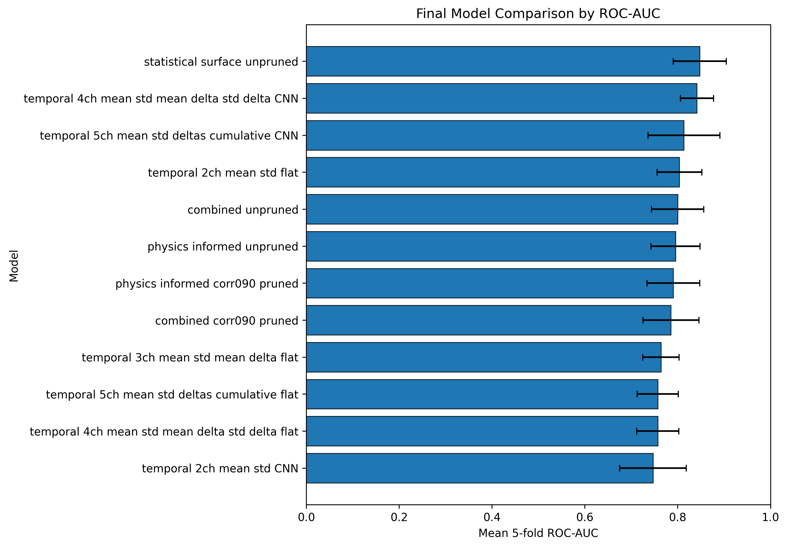

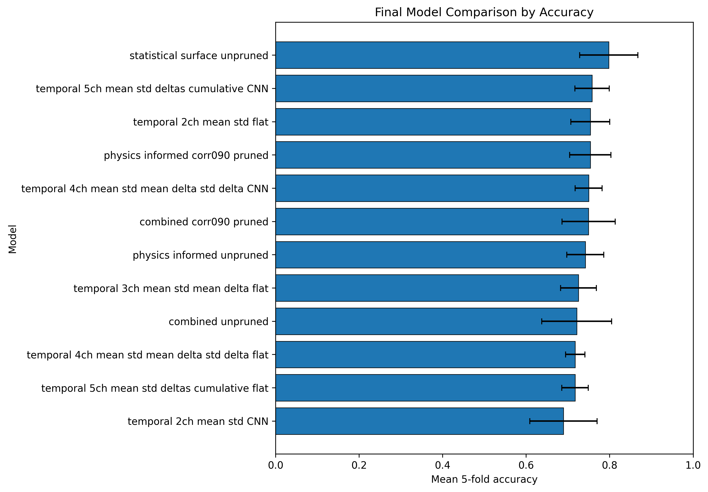

### CNN vs Same-Input Flat Logistic Baseline

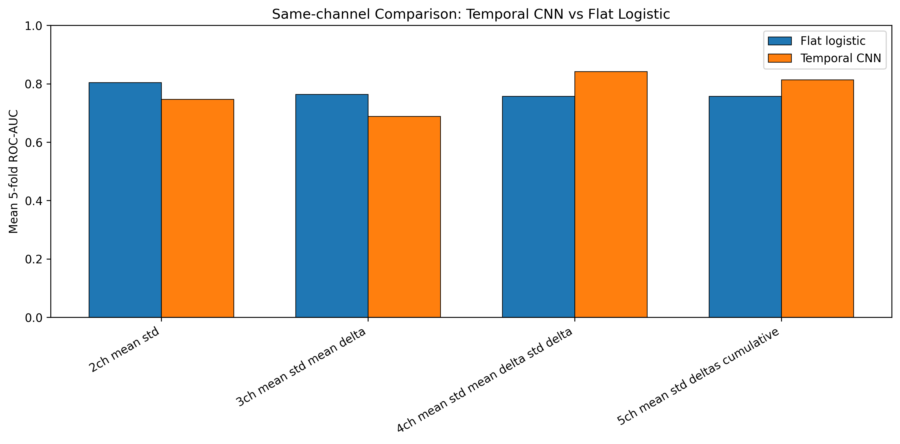

### Dynamic Thermography Feature Analysis

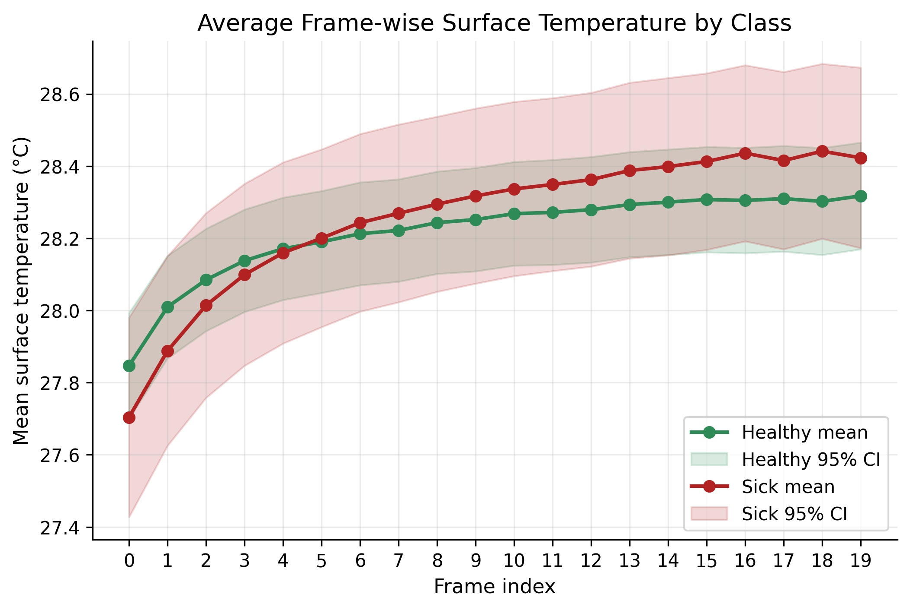

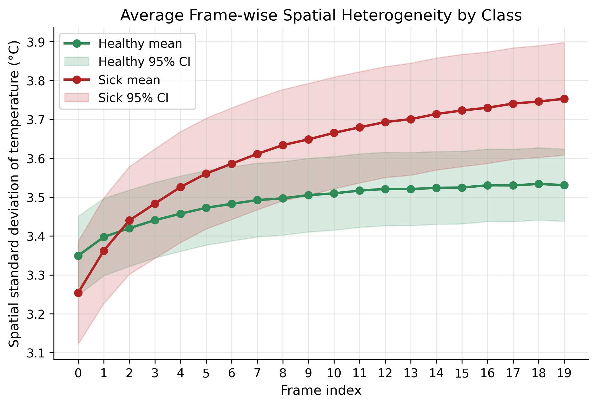

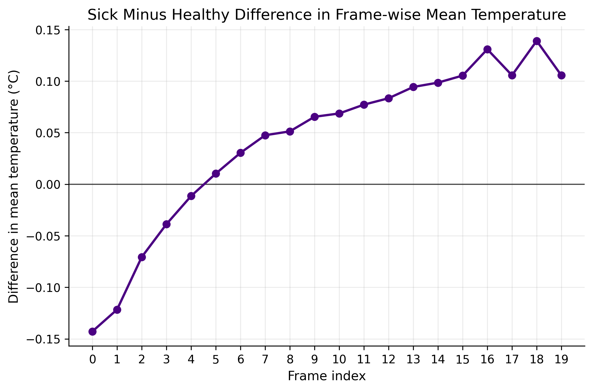

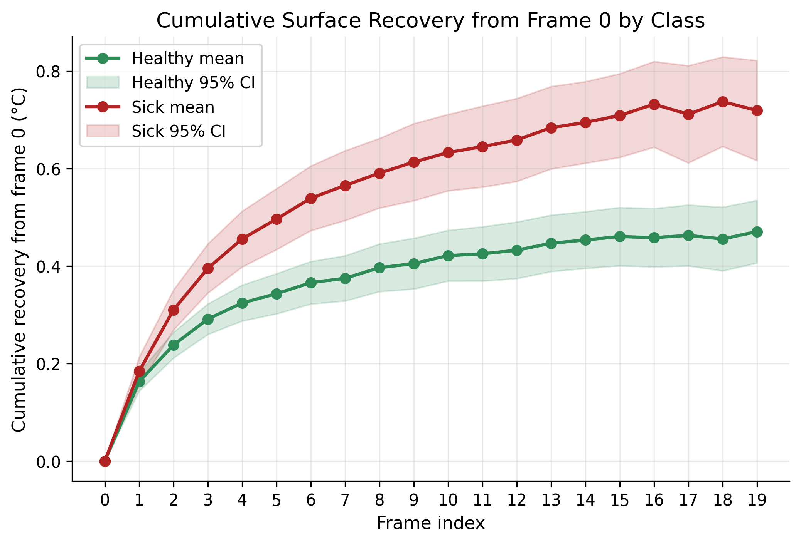

### Local Recovery Analysis

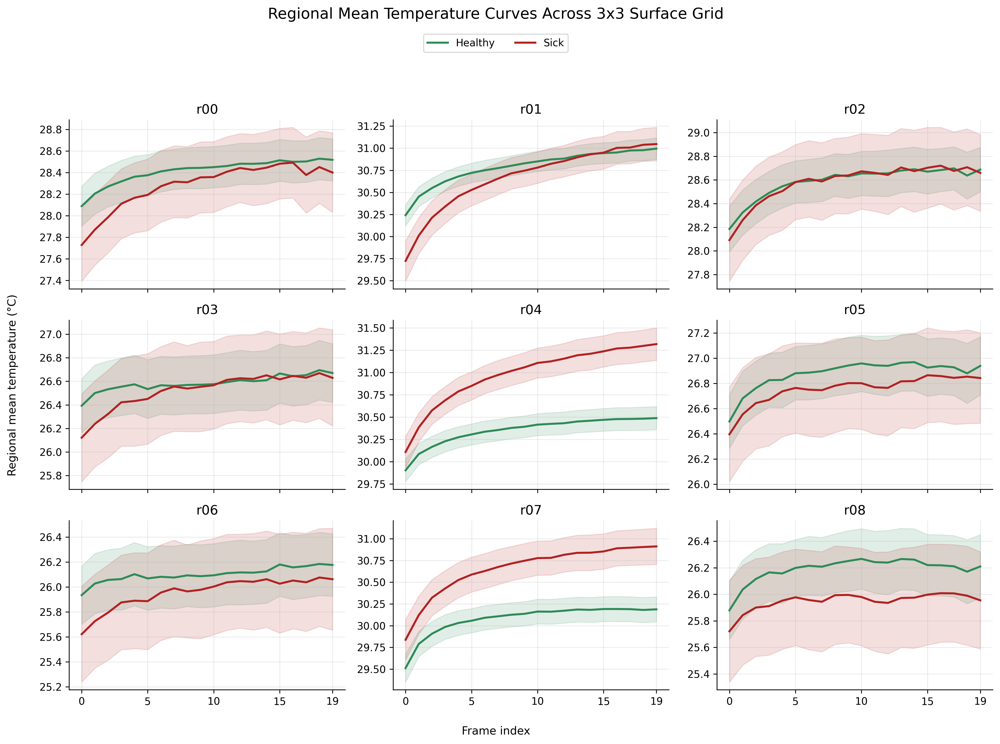

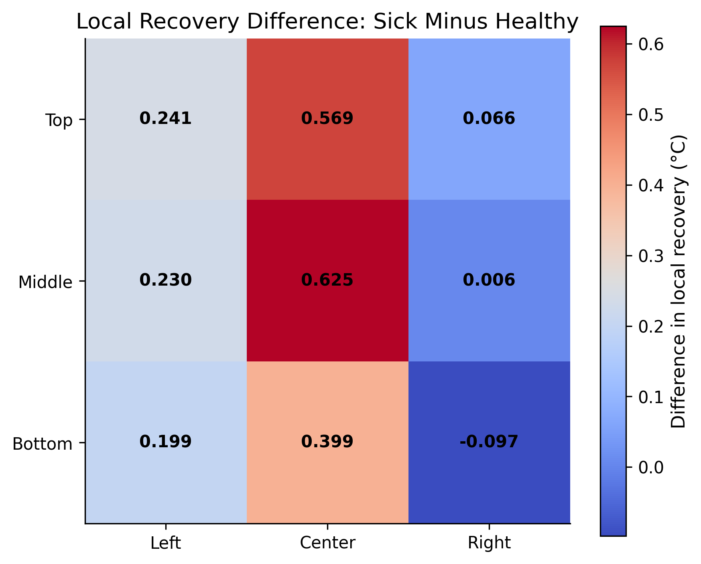

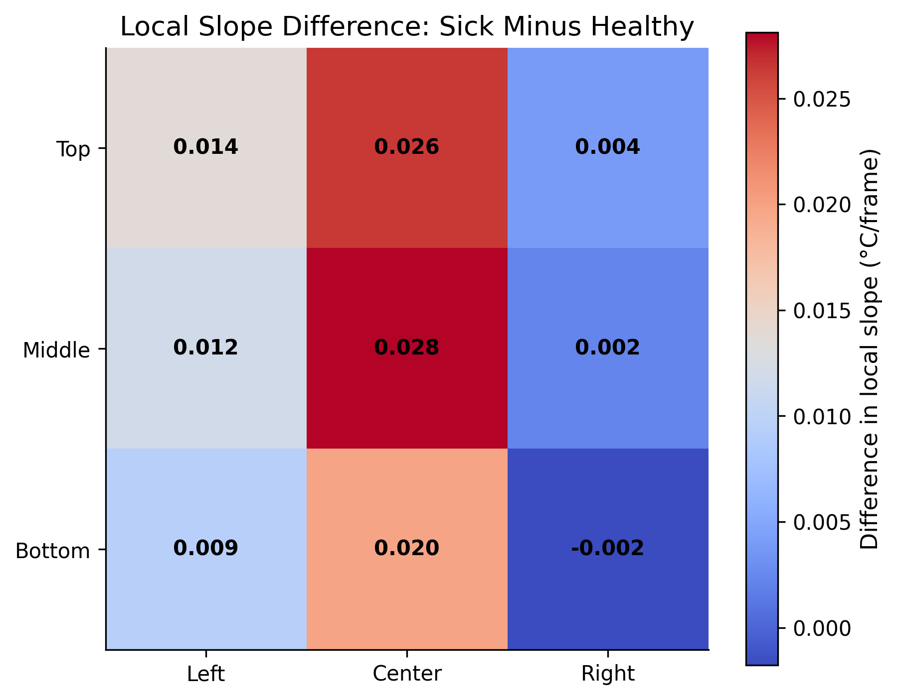

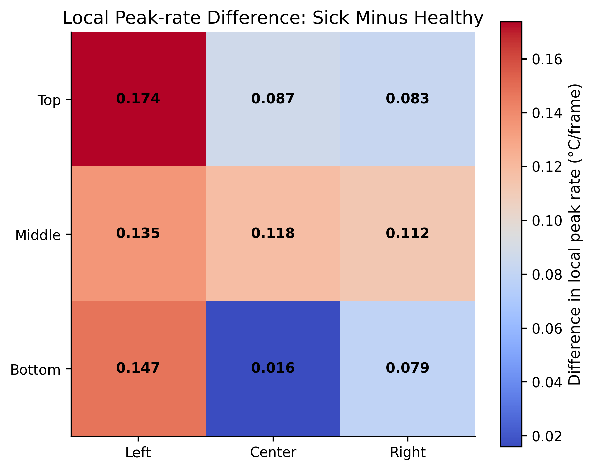

### Statistical Testing

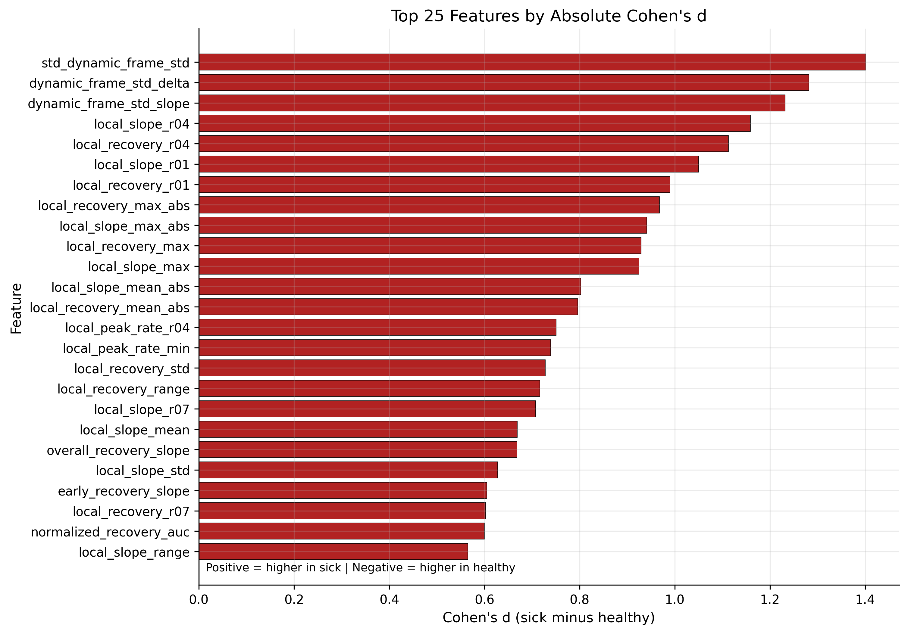

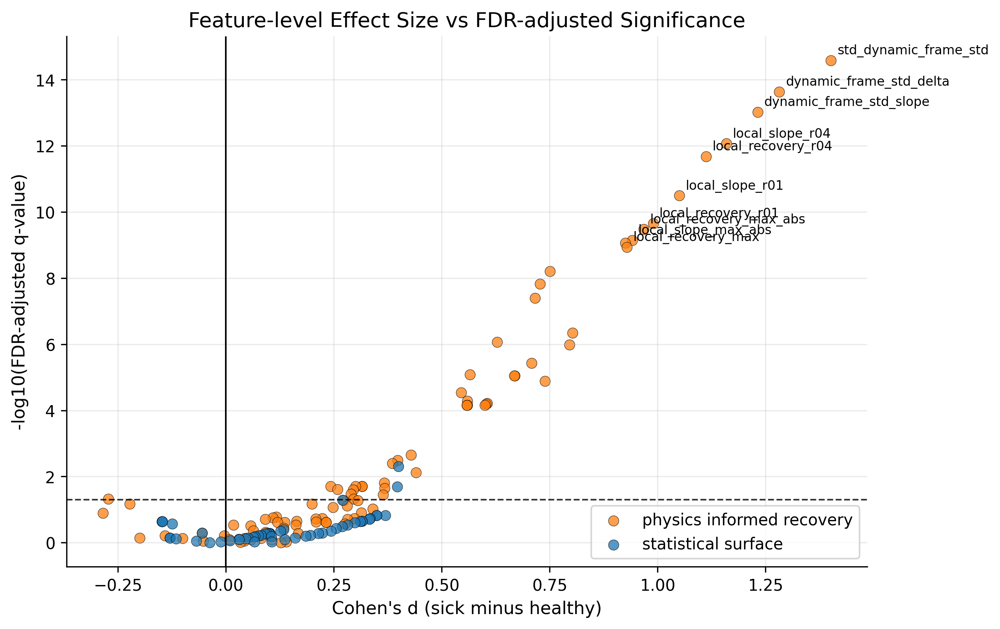

---

## How to Run the Pipeline

Install dependencies:

```bash
pip install -r requirements.txt
```

Run the full reproducible analysis pipeline:

```bash
python main.py --stage all
```

Run individual stages:

```bash
python main.py --stage prepare
python main.py --stage eda
python main.py --stage features
python main.py --stage stats
python main.py --stage logistic
python main.py --stage temporal
python main.py --stage final
```

The downloader is separate because it requires browser-based manual login:

```bash
python downloader.py
```

---

## Main Output Files

### Feature Tables

```text
data/features/statistical_surface_features.csv
data/features/physics_informed_recovery_features.csv
data/features/final_feature_table_144.csv
```

### Statistical Testing Outputs

```text
outputs/tables/statistical_tests/feature_statistical_tests_all.csv
outputs/tables/statistical_tests/feature_statistical_tests_fdr_significant.csv
outputs/tables/statistical_tests/feature_statistical_tests_group_summary.csv
```

### Model Experiment Outputs

```text
outputs/tables/model_experiments/logistic_model_comparison_summary.csv
outputs/tables/temporal_cnn_experiments/temporal_cnn_model_comparison_summary.csv
outputs/tables/final_results/ranked_final_model_comparison.csv
outputs/tables/final_results/top10_final_model_comparison.csv
```

---

## Reproducibility Notes

The modeling pipeline uses stratified 5-fold cross-validation with fixed random seeds.

Feature pruning is performed within the training fold only to avoid test-fold leakage.

For logistic regression, the pipeline uses:

- median imputation
- standard scaling
- class-balanced logistic regression
- accuracy
- balanced accuracy
- ROC-AUC
- precision
- recall/sensitivity
- specificity
- F1-score

For temporal CNN experiments, each outer training fold is split into an inner training and validation split for early stopping.

---

## Data Use Note

This repository assumes authorized access to the DMR-IR database and use of the data for academic research purposes. Raw patient data and derived patient-level data should only be shared according to the dataset provider’s terms and applicable research-data policies.
